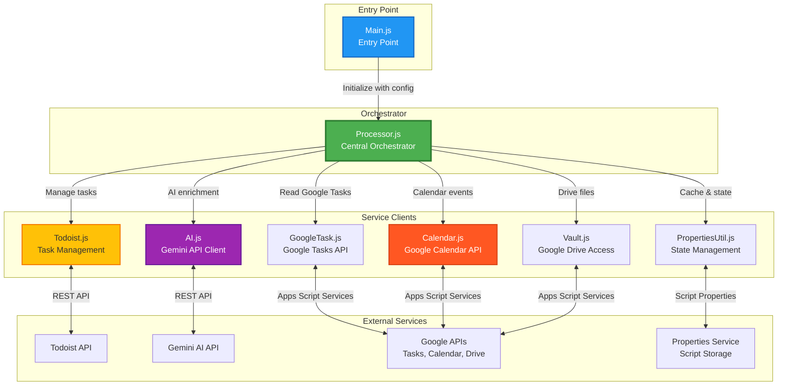
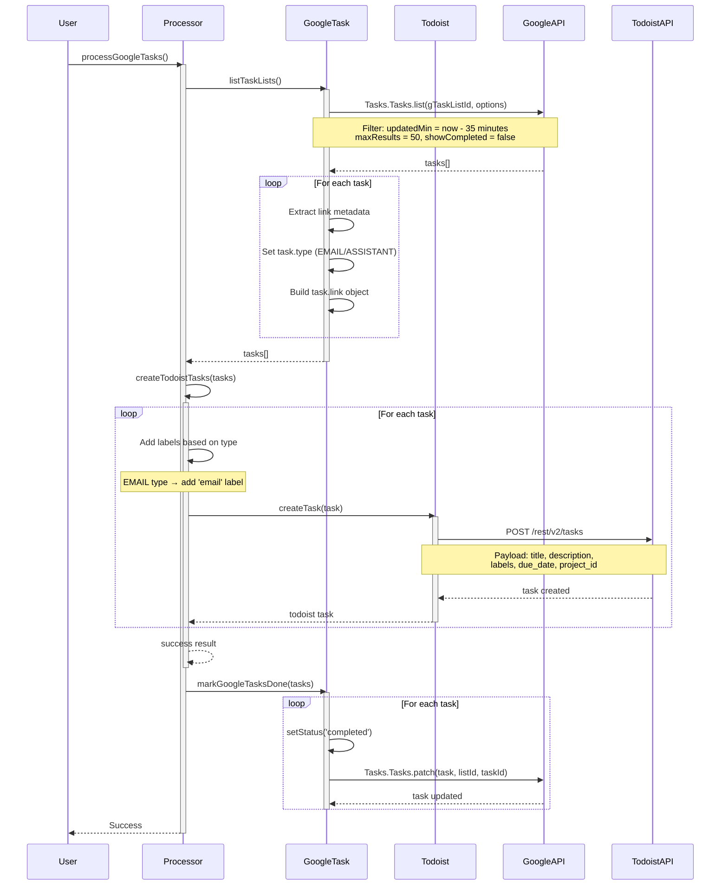
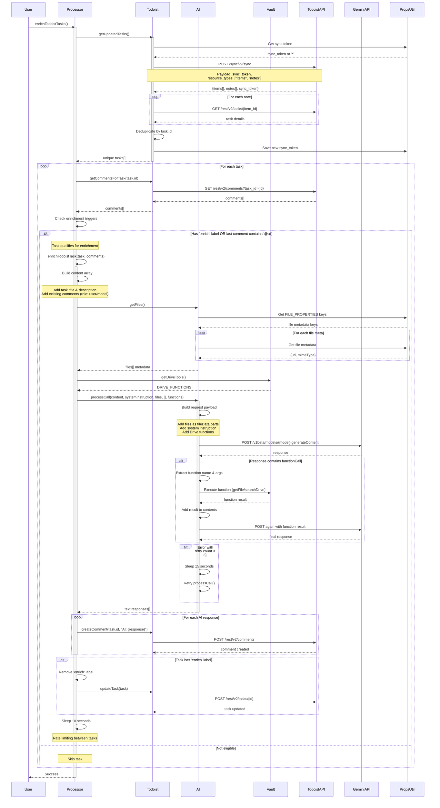
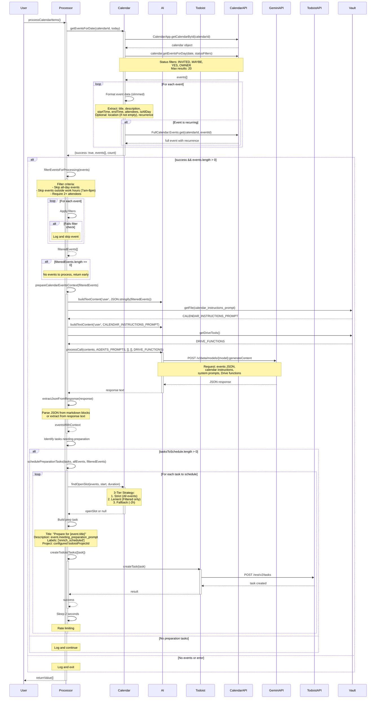
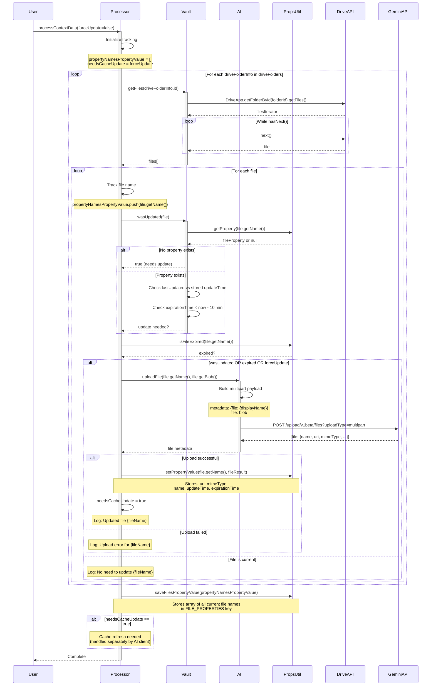
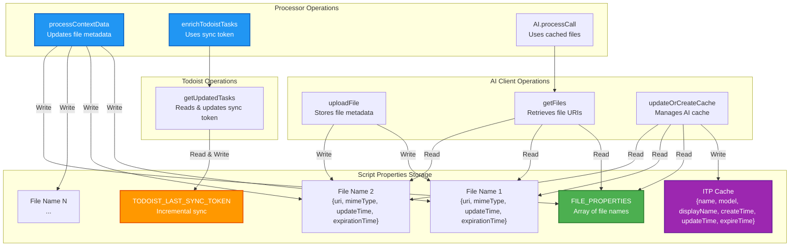
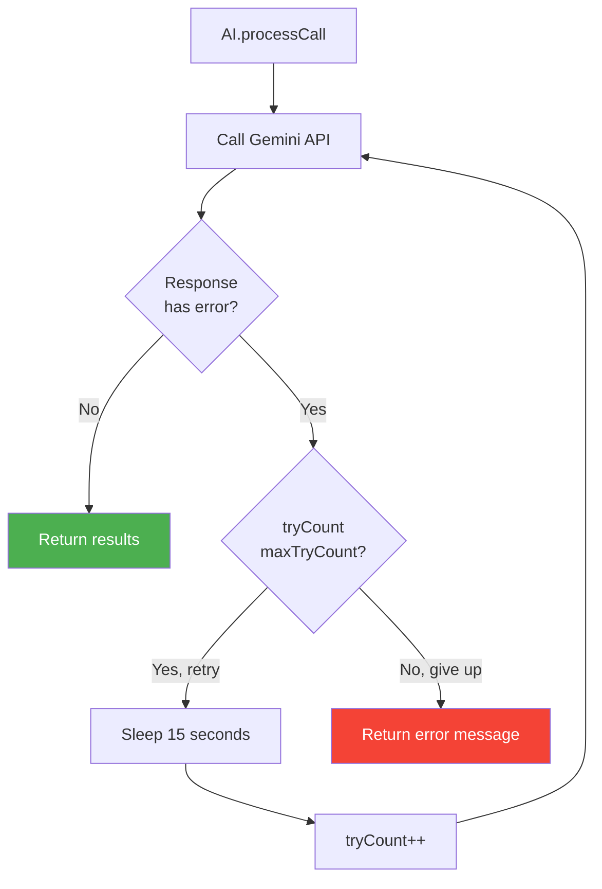

# Sterling Library

An intelligent automation system that orchestrates your life by integrating Google Tasks, Todoist, Google Calendar, and Gemini AI.

## Setup & Installation

### Prerequisites
1.  **Node.js & npm**: Required for `clasp`.
2.  **Clasp**: Google Apps Script command line tool.
    ```bash
    npm install @google/clasp -g
    clasp login
    ```
3.  **Google Cloud Project**: You need a Google Cloud Project with the following APIs enabled:
    *   Google Tasks API
    *   Google Calendar API
    *   Google Drive API
    *   Generative Language API (Gemini)
    *   Google Apps Script API

### Installation

1.  **Clone the repository**
    ```bash
    git clone <repository-url>
    cd sterling-library
    ```

2.  **Push to Google Apps Script**
    ```bash
    clasp push
    ```
    *Note: This will push the files from the `src/` directory.*

### Configuration

1.  **Create your local configuration**
    Copy the example configuration file to a local `test.js` file (which is git-ignored).
    ```bash
    cp src/test.js.example src/test.js
    ```

2.  **Update your secrets**
    Edit `src/test.js` and fill in your API keys and IDs:
    *   `gTaskListId`: ID of the Google Task list to monitor.
    *   `calendarId`: Your Google Calendar ID (usually your email or 'primary').
    *   `geminiApiKey`: API Key for Google Gemini.
    *   `todoistApiKey`: API Key for Todoist.
    *   `todoistProjectId`: ID of the Todoist project for new tasks.
    *   `driveFolders`: Array of Google Drive folder IDs to use for AI context.

3.  **Deploy Triggers**
    Open the script in the Google Apps Script editor (`clasp open`) and set up time-driven triggers for the `Processor` functions:
    *   `processGoogleTasks` (every 10 mins)
    *   `enrichTodoistTasks` (every 10 mins)
    *   `processContextData` (every 5 mins)
    *   `processCalendarItems` (daily 6-7 AM)

---

## System Flows & Architecture

This document provides comprehensive visual documentation of all data flows in the Sterling Library system, with **Processor.js** as the central orchestrator.

## Table of Contents
- [System Architecture Overview](#system-architecture-overview)
- [Flow 1: Google Tasks → Todoist Conversion](#flow-1-google-tasks--todoist-conversion)
- [Flow 2: AI Task Enrichment](#flow-2-ai-task-enrichment)
- [Flow 3: Calendar Event Processing](#flow-3-calendar-event-processing)
- [Flow 4: Context Data Update](#flow-4-context-data-update)
- [Flow 5: Data & State Management](#flow-5-data--state-management)

---

## System Architecture Overview



### Component Responsibilities

| Component | Responsibility | Key Methods |
|-----------|---------------|-------------|
| **Main.js** | Entry point, configuration initialization | `main()` |
| **Processor.js** | Central orchestrator for all workflows | `enrichTodoistTasks()`, `processGoogleTasks()`, `processCalendarItems()`, `processContextData()` |
| **Todoist.js** | Todoist API integration, task & comment management | `createTask()`, `getUpdatedTasks()`, `createComment()` |
| **GoogleTask.js** | Google Tasks API integration | `listTaskLists()`, `markGoogleTasksDone()` |
| **AI.js** | Gemini AI client with file upload, caching, retry logic | `processCall()`, `uploadFile()`, `updateOrCreateCache()` |
| **Calendar.js** | Google Calendar event management | `getEventsForDate()` |
| **Vault.js** | Google Drive file access and management | `getFiles()`, `getFile()`, `searchDrive()` |
| **PropertiesUtil.js** | Script properties management with expiration | `setPropertyValue()`, `getScriptPropertyObject()` |

---

## Flow 1: Google Tasks → Todoist Conversion

This flow converts Google Tasks into Todoist tasks and marks them as complete.



### Key Details:
- **Trigger**: Time-driven, every 10 minutes
- **Time Window**: Tasks updated in last 35 minutes
- **Label Mapping**: EMAIL type tasks get 'email' label + configured label
- **Completion**: Google Tasks marked complete after Todoist creation
- **Error Handling**: Try-catch blocks with logging at each stage

---

## Flow 2: AI Task Enrichment

This flow enriches Todoist tasks with AI-generated content using Gemini and context from Drive files.



### Key Details:
- **Trigger**: Time-driven, every 10 minutes
- **Enrichment Criteria**: Task has 'enrich' label OR last comment contains '@ai'
- **AI Context**:
  - System instruction from Drive file (agents_prompt)
  - All uploaded Drive files as context
  - Previous comments (maintaining conversation history)
  - Drive function calling (getFile, searchDrive)
- **Sync Token**: Incremental sync to only process changed tasks
- **Rate Limiting**: 10-second sleep between task enrichments
- **Retry Logic**: AI calls retry up to 3 times with 15-second intervals
- **Comment Prefix**: All AI responses prefixed with "AI: "

---

## Flow 3: Calendar Event Processing

This flow analyzes calendar events and creates preparation tasks in Todoist with smart filtering to reduce token usage.



### Key Details:
- **Trigger**: Time-driven, daily between 6 AM and 7 AM
- **Event Selection**: Today's events where user status is INVITED/MAYBE/YES/OWNER
- **Smart Filtering** (Processor.js:163):
  - Skips all-day events (no preparation needed)
  - Skips events outside work hours (7am-8pm)
  - Requires 2+ attendees (excludes personal/solo events)
  - Significantly reduces token usage by filtering before AI call
- **Slimmed Event Data** (Calendar.js:168):
  - Removed: `id` field (not needed for AI analysis)
  - Conditional: `location` only if non-empty
  - Kept: `title`, `description`, `startTime`, `endTime`, `attendees`, `isAllDay`, `recurrence`
  - Reduces token count per event by ~20-30%
- **Batch Processing** (Processor.js:261):
  - Events processed in batches of 3
  - Multiple AI calls instead of one massive request
  - Spreads token usage across multiple requests
  - Prevents hitting free tier input token limits
  - Configurable batch size for optimization
- **AI Analysis**:
  - Determines which events need preparation
  - Generates meeting_preparation_prompt for each event
  - Estimates preparation duration (`duration_estimation`) or defaults to 45 mins
  - Uses calendar-specific instructions from Drive
  - Processes 3 events per AI call (batch size)
- **Preparation Tasks**:
  - **3-Tier Scheduling Strategy**:
    1. **Strict**: Attempts to find a slot avoiding *all* calendar events (both processed/filtered and others).
    2. **Lenient**: If strict fails, attempts to find a slot avoiding *only* processed/filtered events (allowing overlap with placeholders/personal items).
    3. **Fallback**: If both fail, schedules 2 hours before event start.
  - Maintains a `newlyScheduledSlots` list to ensure tasks in the same run don't overlap each other.
  - Automatically labeled with 'enrich_scheduled' for later processing
  - Contains AI-generated preparation guidance
- **Rate Limiting**:
  - 10 seconds between batch AI calls
  - 20 seconds between task creations
- **JSON Extraction**: Handles markdown code blocks and raw JSON responses
- **Token Optimization**: Combined filtering + slimming + batching reduces peak input tokens by 75-85%

---

## Flow 4: Context Data Update

This flow uploads Drive files to Gemini for AI context and manages file caching.



### Key Details:
- **Trigger**: Time-driven, every 5 minutes
- **Drive Folders**: Configured in test.js (PEOPLE_FOLDER, TRIBE_FOLDER, INITIATIVES, ITP_GENERAL, ITP_MEETINGS)
- **Update Criteria**:
  - File has no stored metadata
  - File's lastUpdated > stored updateTime
  - File metadata expired (>10 minutes old)
  - forceUpdate parameter is true
- **File Metadata Stored**:
  - Gemini file URI and MIME type
  - Original file name
  - Update and expiration timestamps
- **Cache Management**: Uploaded files available to AI via getFiles()
- **Property Tracking**: Maintains list of all current files to detect deletions

---

## Flow 5: Data & State Management

This flow shows how the system manages persistent state and caching.



### Property Keys & Data

| Key | Type | Purpose | Managed By |
|-----|------|---------|------------|
| `FILE_PROPERTIES` | Array | List of all current file names | Processor.processContextData() |
| `TODOIST_LAST_SYNC_TOKEN` | String | Incremental sync token from Todoist | Todoist.getUpdatedTasks() |
| `{fileName}` | Object | File metadata: uri, mimeType, updateTime, expirationTime | AI.uploadFile() |
| `ITP Cache` | Object | Gemini cache metadata | AI.updateOrCreateCache() |

### State Flow Details:

1. **File Metadata Lifecycle**:
   - Created when file uploaded to Gemini
   - Read when building AI context
   - Expires after 10 minutes
   - Updated when file changes in Drive

2. **Sync Token Management**:
   - Starts with '*' (full sync)
   - Updated after each successful sync
   - Enables incremental task updates
   - Reduces API calls and processing

3. **Cache Management**:
   - Aggregates all file contexts
   - TTL: 600 seconds (10 minutes)
   - Reduces Gemini API costs
   - Auto-refreshes when files updated

4. **Expiration Strategy**:
   - Files: 10 minutes since last check
   - Cache: 10 minutes (600s TTL)
   - Balances freshness vs API calls

---

## Error Handling & Retry Logic

### AI Client Retry Mechanism


**Retry Configuration**:
- Max retries: 3
- Interval: 15 seconds
- Applies to: All Gemini API calls

### Rate Limiting
- **Task Enrichment**: 10 seconds between tasks
- **Calendar Processing**:
  - 10 seconds after event analysis
  - 20 seconds between preparation task creation
- **Purpose**: Prevent API throttling, give AI processing time

---

## Summary: Processor.js as Orchestrator

**Processor.js** coordinates all system flows by:

1. **Managing Service Clients**: Initializes and maintains references to all service clients
2. **Orchestrating Workflows**: Implements high-level business logic across multiple services
3. **Handling Errors**: Wraps operations in try-catch blocks with comprehensive logging
4. **Rate Limiting**: Controls timing between operations to prevent API throttling
5. **Context Management**: Ensures AI has current context from Drive files
6. **State Coordination**: Works with PropertiesUtil to maintain persistent state

### Processor Public API

```javascript
{
  processGoogleTasks,        // Flow 1: Google Tasks → Todoist
  enrichTodoistTasks,        // Flow 2: AI Task Enrichment
  processCalendarItems,      // Flow 3: Calendar Event Processing
  processContextData,        // Flow 4: Context Data Update
  enrichTodaysTasksForLabel  // Batch enrichment by label & date
}
```

All flows are triggered through Processor methods, making it the single point of coordination for the entire system.

---

## Flow 6: Just-In-Time Task Preparation

This flow enriches Todoist tasks with the label 'prepare_jit' using AI, preparing them for the day ahead.

### Key Details:
- **Trigger**: Time-driven, daily between 7 AM and 8 AM, calling `enrichTodaysTasksForLabel` with the parameter `'prepare_jit'`.
- **Purpose**: Prepare tasks labeled 'prepare_jit' for the current day.
