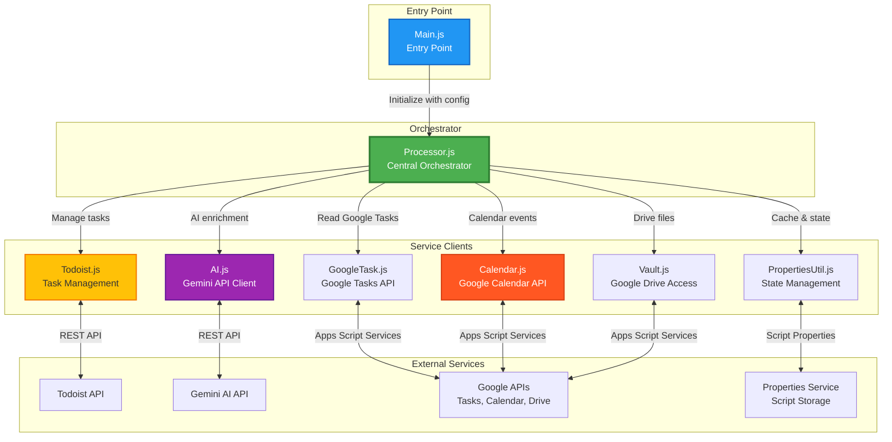
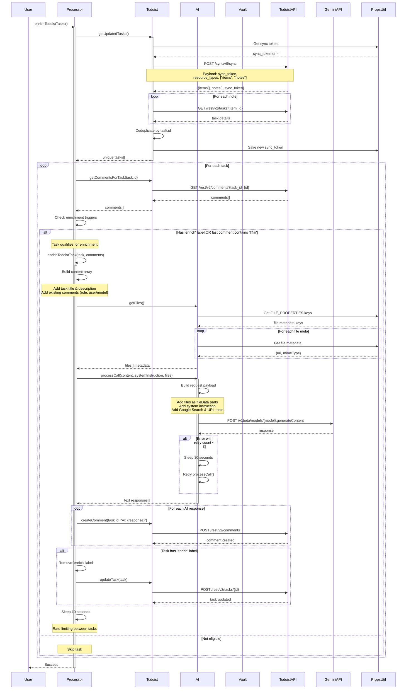
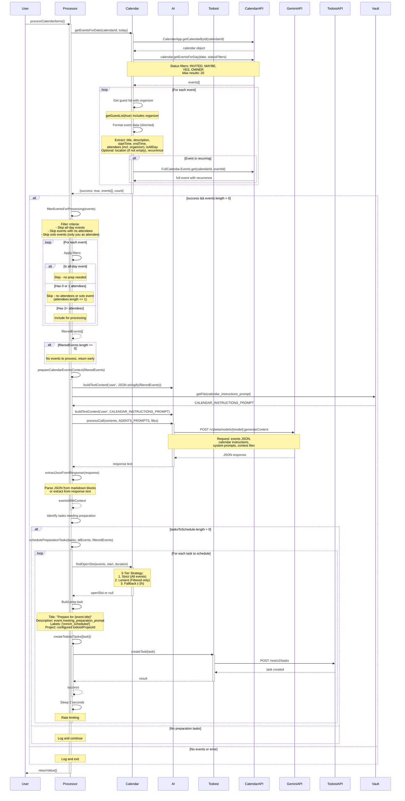
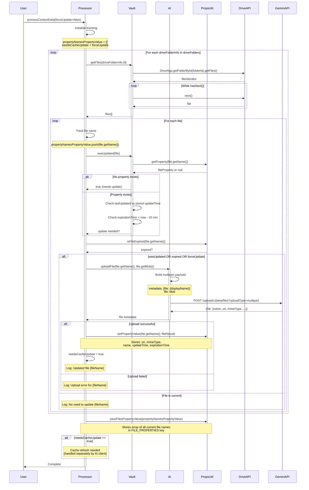
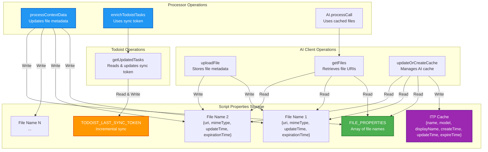
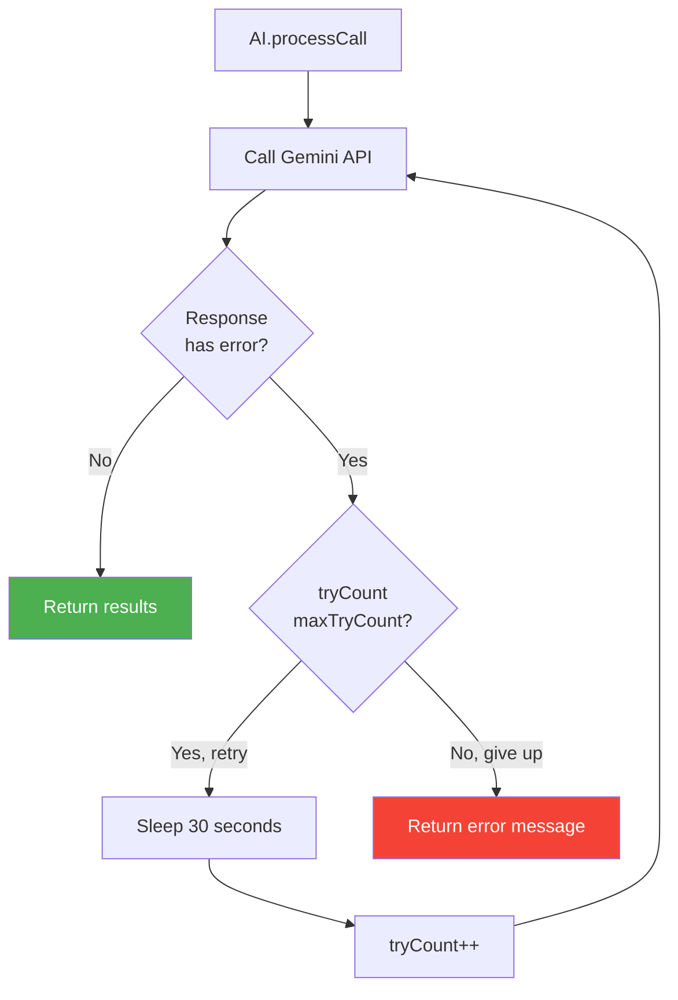
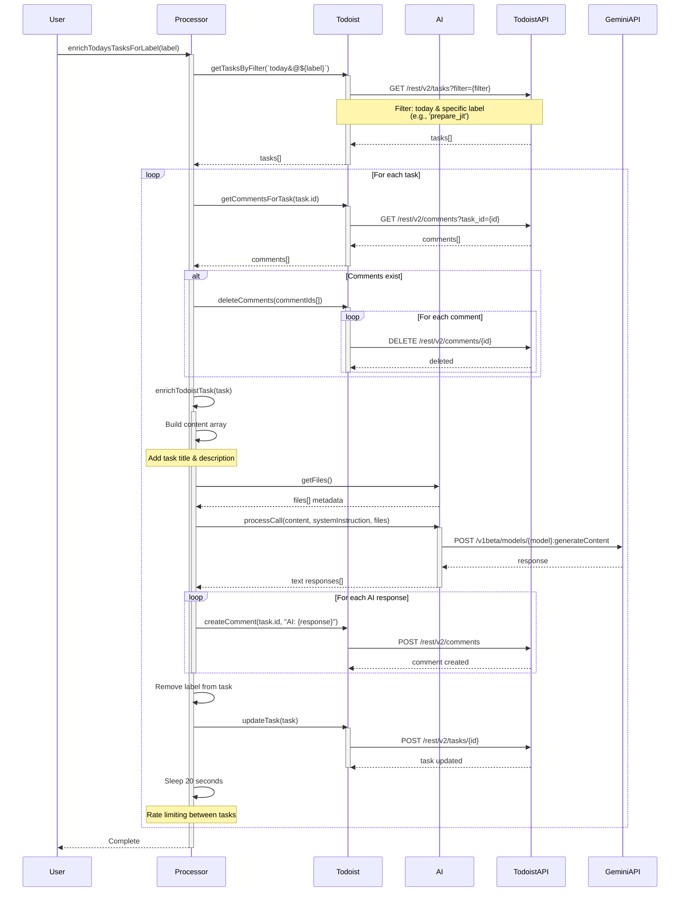

# Sterling Library Architecture

Comprehensive visual documentation of all data flows in Sterling Library, with **Processor.js** as the central orchestrator.

## Table of Contents
- [System Architecture Overview](#system-architecture-overview)
- [Flow 1: Google Tasks → Todoist Conversion](#flow-1-google-tasks--todoist-conversion)
- [Flow 2: AI Task Enrichment](#flow-2-ai-task-enrichment)
- [Flow 3: Calendar Event Processing](#flow-3-calendar-event-processing)
- [Flow 4: Context Data Update](#flow-4-context-data-update)
- [Flow 5: Data & State Management](#flow-5-data--state-management)
- [Flow 6: Just-In-Time Task Preparation](#flow-6-just-in-time-task-preparation)
- [Flow 7: Daily Briefing Generation](#flow-7-daily-briefing-generation)
- [Flow 8: Quick Wins Summary](#flow-8-quick-wins-summary)

---

## System Architecture Overview



## Component Responsibilities

| Component | Responsibility | Key Methods |
|-----------|---------------|-------------|
| **Main.js** | Entry point, configuration initialization | `main()` |
| **Processor.js** | Central orchestrator for all workflows | `enrichTodoistTasks()`, `processGoogleTasks()`, `processCalendarItems()`, `processContextData()`, `enrichTodaysTasksForLabel()`, `generateDailyBriefing()`, `generateQuickWinsSummary()` |
| **Todoist.js** | Todoist API integration, task & comment management | `createTask()`, `getUpdatedTasks()`, `createComment()`, `getTasksByFilter()`, `deleteComments()`, `updateTask()` |
| **GoogleTask.js** | Google Tasks API integration | `listTaskLists()`, `markGoogleTasksDone()` |
| **AI.js** | Gemini AI client with file upload and retry logic | `processCall()`, `uploadFile()`, `getFiles()`, `deleteFile()`, `deleteFileByDisplayName()`, `buildTextContent()`, `buildFileParts()` |
| **Calendar.js** | Google Calendar event management | `getEventsForDate()`, `findOpenSlot()`, `parseTimeString()` |
| **Vault.js** | Google Drive file access and management | `getFiles()`, `getFile()`, `wasUpdated()` |
| **PropertiesUtil.js** | Script properties management with expiration | `setPropertyValue()`, `getScriptPropertyObject()`, `isFileExpired()`, `getFilesPropertyValue()`, `saveFilesPropertyValue()` |
| **Telemetry.js** | Structured logging and error tracking | `init()`, `getLogger()` (returns logger with `info()`, `error()`, `warn()`, `debug()`) |

---

## Flow 1: Google Tasks → Todoist Conversion

This flow converts Google Tasks into Todoist tasks and marks them as complete.

```mermaid
sequenceDiagram
    participant User
    participant Processor
    participant GoogleTask
    participant Todoist
    participant GoogleAPI
    participant TodoistAPI

    User->>Processor: processGoogleTasks()
    activate Processor

    Processor->>GoogleTask: listTaskLists()
    activate GoogleTask
    GoogleTask->>GoogleAPI: Tasks.Tasks.list(gTaskListId, options)
    Note over GoogleTask,GoogleAPI: Filter: updatedMin = now - 35 minutes<br/>maxResults = 50, showCompleted = false
    GoogleAPI-->>GoogleTask: tasks[]

    loop For each task
        GoogleTask->>GoogleTask: Extract link metadata
        GoogleTask->>GoogleTask: Set task.type (EMAIL/ASSISTANT)
        GoogleTask->>GoogleTask: Build task.link object
    end

    GoogleTask-->>Processor: tasks[]
    deactivate GoogleTask

    Processor->>Processor: createTodoistTasks(tasks)
    activate Processor

    loop For each task
        Processor->>Processor: Add labels based on type
        Note over Processor: EMAIL type → add 'email' label

        Processor->>Todoist: createTask(task)
        activate Todoist
        Todoist->>TodoistAPI: POST /rest/v2/tasks
        Note over Todoist,TodoistAPI: Payload: title, description,<br/>labels, due_date, project_id
        TodoistAPI-->>Todoist: task created
        Todoist-->>Processor: todoist task
        deactivate Todoist
    end

    Processor-->>Processor: success result
    deactivate Processor

    Processor->>GoogleTask: markGoogleTasksDone(tasks)
    activate GoogleTask

    loop For each task
        GoogleTask->>GoogleTask: setStatus('completed')
        GoogleTask->>GoogleAPI: Tasks.Tasks.patch(task, listId, taskId)
        GoogleAPI-->>GoogleTask: task updated
    end

    deactivate GoogleTask

    Processor-->>User: Success
    deactivate Processor
```



### Key Details:
- **Trigger**: Time-driven, every 10 minutes
- **Time Window**: Tasks updated in last 35 minutes
- **Label Mapping**: EMAIL type tasks get 'email' label + configured label
- **Completion**: Google Tasks marked complete after Todoist creation
- **Error Handling**: Try-catch blocks with logging at each stage

---

## Flow 2: AI Task Enrichment

This flow enriches Todoist tasks with AI-generated content using Gemini and context from Drive files.



### Key Details:
- **Trigger**: Time-driven, every 10 minutes
- **Enrichment Criteria**: Task has 'enrich' label OR last comment contains '@ai'
- **AI Context**:
  - System instruction from Drive file (agents_prompt)
  - All uploaded Drive files as context
  - Previous comments (maintaining conversation history)
  - Google Search and URL context tools enabled
- **Sync Token**: Incremental sync to only process changed tasks
- **Rate Limiting**: 10-second sleep between task enrichments
- **Retry Logic**: AI calls retry up to 3 times with 30-second intervals
- **Comment Prefix**: All AI responses prefixed with "AI: "

---

## Flow 3: Calendar Event Processing

This flow analyzes calendar events and creates preparation tasks in Todoist with smart filtering to reduce token usage.



### Key Details:
- **Trigger**: Time-driven, daily between 6 AM and 7 AM
- **Event Selection**: Today's events where user status is INVITED/MAYBE/YES/OWNER
- **Smart Filtering** (Processor.js:180):
  - Skips all-day events (no preparation needed)
  - Skips events with ≤1 attendees (no attendees or solo events)
  - Attendees list includes organizer via `getGuestList(true)`
  - Significantly reduces token usage by filtering before AI call
- **Slimmed Event Data** (Calendar.js:26):
  - Includes organizer in attendees list using `getGuestList(true)`
  - Conditional: `location` only if non-empty
  - Kept: `title`, `description`, `startTime`, `endTime`, `attendees`, `isAllDay`, `recurrence`
  - Reduces token count per event by ~20-30%
- **Batch Processing** (Processor.js:261):
  - Events processed in batches of 3
  - Multiple AI calls instead of one massive request
  - Spreads token usage across multiple requests
  - Prevents hitting free tier input token limits
  - Configurable batch size for optimization
- **AI Analysis**:
  - Determines which events need preparation
  - Generates meeting_preparation_prompt for each event
  - Estimates preparation duration (`duration_estimation`) or defaults to 45 mins
  - Uses calendar-specific instructions from Drive
  - Processes 3 events per AI call (batch size)
- **Preparation Tasks**:
  - **3-Tier Scheduling Strategy**:
    1. **Strict**: Attempts to find a slot avoiding *all* calendar events (both processed/filtered and others).
    2. **Lenient**: If strict fails, attempts to find a slot avoiding *only* processed/filtered events (allowing overlap with placeholders/personal items).
    3. **Reduced Duration**: Try 30, 15, 10 minute durations with both strict and lenient strategies.
    4. **Last Resort Fallback**: If all strategies fail, schedules 30 minutes before event start.
  - Maintains a `newlyScheduledSlots` list to ensure tasks in the same run don't overlap each other.
  - Automatically labeled with 'enrich_scheduled' for later processing
  - Contains AI-generated preparation guidance
- **Rate Limiting**:
  - 10 seconds between batch AI calls
  - 20 seconds between task creations
- **JSON Extraction**: Handles markdown code blocks and raw JSON responses
- **Token Optimization**: Combined filtering + slimming + batching reduces peak input tokens by 75-85%

---

## Flow 4: Context Data Update

This flow uploads Drive files to Gemini for AI context and manages file caching.



### Key Details:
- **Trigger**: Time-driven, every 5 minutes
- **Drive Folders**: Array of Google Drive folder IDs to use for AI context
- **Update Criteria**:
  - File has no stored metadata
  - File's lastUpdated > stored updateTime
  - File metadata expired (>10 minutes old)
  - forceUpdate parameter is true
- **File Metadata Stored**:
  - Gemini file URI and MIME type
  - Original file name
  - Update and expiration timestamps
- **Cache Management**: Uploaded files available to AI via getFiles()
- **Property Tracking**: Maintains list of all current files to detect deletions

---

## Flow 5: Data & State Management

This flow shows how the system manages persistent state and caching.



### Property Keys & Data

| Key | Type | Purpose | Managed By |
|-----|------|---------|------------|
| `FILE_PROPERTIES` | Array | List of all current file names | Processor.processContextData() |
| `TODOIST_LAST_SYNC_TOKEN` | String | Incremental sync token from Todoist | Todoist.getUpdatedTasks() |
| `{fileName}` | Object | File metadata: uri, mimeType, updateTime, expirationTime | AI.uploadFile() |
| `ITP Cache` | Object | Gemini cache metadata | AI.updateOrCreateCache() |

### State Flow Details:

1. **File Metadata Lifecycle**:
   - Created when file uploaded to Gemini
   - Read when building AI context
   - Expires after 10 minutes
   - Updated when file changes in Drive

2. **Sync Token Management**:
   - Starts with '*' (full sync)
   - Updated after each successful sync
   - Enables incremental task updates
   - Reduces API calls and processing

3. **Cache Management**:
   - Aggregates all file contexts
   - TTL: 600 seconds (10 minutes)
   - Reduces Gemini API costs
   - Auto-refreshes when files updated

4. **Expiration Strategy**:
   - Files: 10 minutes since last check
   - Cache: 10 minutes (600s TTL)
   - Balances freshness vs API calls

---

## Error Handling & Retry Logic

### AI Client Retry Mechanism


**Retry Configuration**:
- Max retries: 3
- Interval: 30 seconds
- Applies to: All Gemini API calls

### Rate Limiting
- **Task Enrichment**: 10 seconds between tasks (Flow 2)
- **Calendar Processing**:
  - 2 seconds between preparation task creation (Flow 3)
- **Just-In-Time Preparation**: 20 seconds between tasks (Flow 6)
- **Purpose**: Prevent API throttling, give AI processing time

---

## Summary: Processor.js as Orchestrator

**Processor.js** coordinates all system flows by:

1. **Managing Service Clients**: Initializes and maintains references to all service clients
2. **Orchestrating Workflows**: Implements high-level business logic across multiple services
3. **Handling Errors**: Wraps operations in try-catch blocks with comprehensive logging
4. **Rate Limiting**: Controls timing between operations to prevent API throttling
5. **Context Management**: Ensures AI has current context from Drive files
6. **State Coordination**: Works with PropertiesUtil to maintain persistent state

### Processor Public API

```javascript
{
  processGoogleTasks,        // Flow 1: Google Tasks → Todoist
  enrichTodoistTasks,        // Flow 2: AI Task Enrichment
  processCalendarItems,      // Flow 3: Calendar Event Processing
  processContextData,        // Flow 4: Context Data Update
  enrichTodaysTasksForLabel, // Flow 6: Just-In-Time Task Preparation
  generateDailyBriefing,     // Generate daily briefing task
  generateQuickWinsSummary   // Generate quick wins summary from inbox
}
```

All flows are triggered through Processor methods, making it the single point of coordination for the entire system.

---

## Flow 6: Just-In-Time Task Preparation

This flow enriches Todoist tasks with a specific label (e.g., 'prepare_jit') using AI, preparing them for the day ahead.



### Key Details:
- **Trigger**: Time-driven, daily between 7 AM and 8 AM, calling `enrichTodaysTasksForLabel` with the parameter `'prepare_jit'`.
- **Purpose**: Prepare tasks labeled 'prepare_jit' for the current day.
- **Task Selection**: Tasks due today with specific label (e.g., 'prepare_jit')
- **Comment Handling**: Deletes all existing comments before enrichment (fresh start)
- **AI Context**:
  - System instruction from Drive file (agents_prompt)
  - All uploaded Drive files as context
  - Task title and description
- **Label Removal**: Automatically removes the trigger label after enrichment
- **Rate Limiting**: 20-second sleep between task enrichments
- **Use Case**: Batch preparation of daily tasks at start of day

---

## Flow 7: Daily Briefing Generation

This flow generates a comprehensive daily briefing task that summarizes calendar events and tasks.

```mermaid
sequenceDiagram
    participant User
    participant Processor
    participant Calendar
    participant Todoist
    participant AI
    participant CalendarAPI
    participant TodoistAPI
    participant GeminiAPI

    User->>Processor: generateDailyBriefing()
    activate Processor

    Processor->>Calendar: getEventsForDate(calendarId, today)
    activate Calendar
    Calendar->>CalendarAPI: Get today's events
    CalendarAPI-->>Calendar: events[]
    Calendar-->>Processor: {success: true, events[]}
    deactivate Calendar

    Processor->>Todoist: getTasksByFilter("today | overdue | p1")
    activate Todoist
    Todoist->>TodoistAPI: GET /rest/v2/tasks?filter={filter}
    TodoistAPI-->>Todoist: tasks[]
    Todoist-->>Processor: tasks[]
    deactivate Todoist

    Processor->>Processor: Build prompt with events and tasks
    Note over Processor: Creates structured JSON with:<br/>- Today's date<br/>- Calendar events<br/>- Tasks (today, overdue, P1)

    Processor->>AI: processCall(prompt, systemInstruction)
    activate AI
    AI->>GeminiAPI: POST /v1beta/models/{model}:generateContent
    Note over AI,GeminiAPI: Request briefing in Markdown:<br/>- Critical Focus<br/>- Schedule Highlights<br/>- Quick Wins<br/>- Prep Notes
    GeminiAPI-->>AI: briefing content (Markdown)
    AI-->>Processor: briefing text
    deactivate AI

    Processor->>Processor: Build briefing task
    Note over Processor: Title: "📅 Daily Briefing: {date}"<br/>Description: AI-generated content<br/>Priority: P1 (4)<br/>Due: today

    Processor->>Todoist: createTask(briefingTask)
    activate Todoist
    Todoist->>TodoistAPI: POST /rest/v2/tasks
    TodoistAPI-->>Todoist: task created
    Todoist-->>Processor: success
    deactivate Todoist

    Processor-->>User: Success
    deactivate Processor
```



### Key Details:
- **Trigger**: Manual or scheduled (recommended: daily between 6 AM and 7 AM)
- **Data Sources**:
  - Calendar events for today
  - Tasks due today, overdue, or priority 1
- **AI Analysis**:
  - Identifies critical focus items (1-2 must-dos)
  - Highlights schedule with tight transitions/conflicts
  - Lists quick wins (15-min tasks)
  - Notes meetings lacking preparation or agenda
- **Output**: Single P1 Todoist task with Markdown briefing
- **Purpose**: Executive summary to start the day with clarity

---

## Flow 8: Quick Wins Summary

This flow analyzes inbox tasks to identify quick 2-minute tasks and creates a summary.

```mermaid
sequenceDiagram
    participant User
    participant Processor
    participant Todoist
    participant AI
    participant TodoistAPI
    participant GeminiAPI

    User->>Processor: generateQuickWinsSummary()
    activate Processor

    Processor->>Todoist: getTasksByFilter("#Inbox")
    activate Todoist
    Todoist->>TodoistAPI: GET /rest/v2/tasks?filter=%23Inbox
    TodoistAPI-->>Todoist: inboxTasks[]
    Todoist-->>Processor: tasks[]
    deactivate Todoist

    alt No inbox tasks
        Note over Processor: Log and return false
        Processor-->>User: No tasks found
    end

    Processor->>Processor: Build analysis prompt
    Note over Processor: Include task data:<br/>- id, content, description<br/>- priority, labels

    Processor->>AI: processCall(analysisPrompt, systemInstruction)
    activate AI
    AI->>GeminiAPI: POST /v1beta/models/{model}:generateContent
    Note over AI,GeminiAPI: Request JSON analysis:<br/>- Identify < 2 min tasks<br/>- Provide reason for each<br/>- Generate motivational summary
    GeminiAPI-->>AI: JSON response
    AI-->>Processor: analysis JSON
    deactivate AI

    Processor->>Processor: extractJsonFromResponse(response)
    Note over Processor: Parse: quick_tasks[], summary

    alt No quick tasks identified
        Note over Processor: Log and return false
        Processor-->>User: No quick wins found
    end

    Processor->>Processor: Build summary task
    Note over Processor: Title: "⚡ Quick Wins Summary: {count} tasks"<br/>Description: Formatted list with reasons<br/>Priority: P2 (3)<br/>Due: today 9:00 AM<br/>Duration: 15 minutes

    Processor->>Todoist: createTask(summaryTask)
    activate Todoist
    Todoist->>TodoistAPI: POST /rest/v2/tasks
    TodoistAPI-->>Todoist: task created
    Todoist-->>Processor: success
    deactivate Todoist

    Processor-->>User: Success
    deactivate Processor
```



### Key Details:
- **Trigger**: Manual or scheduled (recommended: daily between 6 AM and 7 AM)
- **Target**: Tasks in #Inbox project
- **AI Analysis**:
  - Evaluates complexity and execution time
  - Conservative assessment (only truly quick tasks)
  - Common 2-minute tasks: quick emails, simple decisions, short calls, lookups
  - Excludes: vague tasks, research, coordination, creative work
- **Output Format**: P2 task scheduled at 9 AM with:
  - Numbered list of quick wins
  - Reason for each selection
  - Motivational summary (2-3 sentences)
- **Duration**: 15 minutes allocated for review
- **Purpose**: Batch quick tasks for momentum and productivity

---

## Smart Context Sync

The `processContextData()` function implements intelligent caching to keep your AI context fresh while minimizing API usage:

**How it works:**
```javascript
// Only uploads files that have actually changed
if (VaultClient.wasUpdated(file) || PropertiesUtil.isFileExpired(file.getName()) || forceUpdate) {
  var fileResult = AiClient.uploadFile(file.getName(), file.getBlob());
}
```

**Result:** Near-real-time context freshness with minimal API costs. The system only uploads files when:
- File has been modified since last upload
- File metadata has expired (>10 minutes)
- Force update is requested
